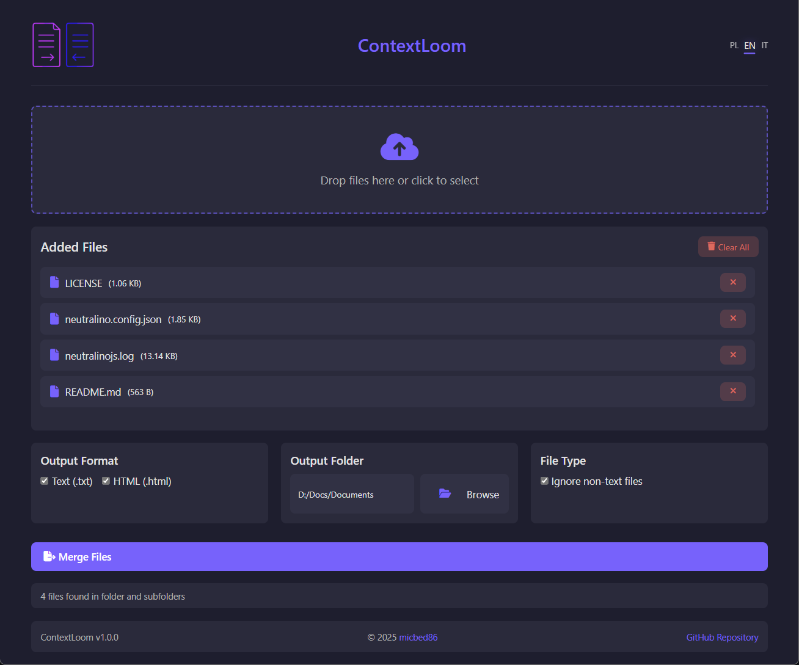

# ContextLoom


**ContextLoom** is a lightweight desktop application designed to merge the content of various files into a single TXT or HTML document. Whether you're working with code, documents, or mixed file types, ContextLoom extracts readable text and consolidates it into one file — perfect for creating a context document for large language models (LLMs) or quick content sharing.

Built with [Neutralinojs](https://neutralino.js.org/), ContextLoom is portable, fast, and requires no installation.

---

## What is ContextLoom?

Have you ever wanted to discuss multiple files with an LLM, but hit a wall because of file limits or unsupported formats? ContextLoom solves that problem. It takes any number of files — be it code (PHP, Python, JS, etc.), documents (DOCX, PDF, ODT), or other text-containing files — and merges their content into a single, easy-to-use document. Simply upload the result to your chatbot or paste it into a conversation. No more file juggling or format struggles!

---

## Key Features

- **Drag-and-Drop Simplicity**: Add files effortlessly by dragging them into the app or selecting them manually.
- **Customizable File Order**: Sort your file list with a drag-and-drop interface to control the merge sequence.
- **Folder Support**: Process entire folders and choose your output directory with ease.
- **Flexible Output**: Export your merged content as a `.txt` or `.html` file — or both!
- **Text Extraction**: Extracts readable text from a wide range of file types, including code, documents, and more.
- **Non-Text Filtering**: Optionally skip non-text files during merging.
- **Multilingual Interface**: Available in English (EN), Polish (PL), and Italian (IT).
- **Portable Design**: No installation needed—download and run it anywhere.

---

## Screenshots



---

## System Requirements

- **Operating System**: Windows, Linux, or macOS.
- **Dependencies**: None — everything’s bundled in the app.

---

## Installation & Usage

1. **Download**:
   - Grab the latest version from [Releases](https://github.com/micbed86/contextloom/releases).
   - Extract the archive to your preferred location.

2. **Launch**:
   - **Windows**: Double-click `ContextLoom.exe`.
   - **Linux/macOS**: Run `./ContextLoom` in the terminal (ensure executable permissions).

3. **Merge Files**:
   - Drag files into the app or use "Browse" to select a folder.
   - Arrange files in your desired order.
   - Choose output format(s) (TXT, HTML) and destination folder.
   - Hit "Merge Files" to create your consolidated document.

---

## Building from Source

Want to tweak ContextLoom yourself? Here’s how to build it:

1. **Prerequisites**:
   - [Node.js](https://nodejs.org/) and [npm](https://www.npmjs.com/).
   - [Neutralinojs CLI](https://neutralino.js.org/docs/getting-started/build-and-run#installing-the-cli): `npm install -g @neutralinojs/neu`.

2. **Steps**:
   ```bash
   git clone https://github.com/micbed86/contextloom.git
   cd contextloom
   npm install
   neu build
   ```
   - Find the compiled binary in the `dist` folder.

---

## License

ContextLoom is released under the [MIT License](LICENSE). Feel free to use, modify, and share it as you see fit.

---

## Contributors

- [micbed86](https://github.com/micbed86) – Developer.

Want to contribute? Open an issue or submit a pull request—we’d love your help!

---

## Acknowledgments

- [Neutralinojs](https://neutralino.js.org/) – For a lightweight desktop app framework.
- [Font Awesome](https://fontawesome.com/) – For the icons enhancing the UI.
- [SortableJS](https://github.com/SortableJS/Sortable) – For smooth drag-and-drop sorting.
- [Mammoth](https://github.com/mwilliamson/mammoth.js) – For DOCX file processing.
- [pdf-parse](https://github.com/Hopding/pdf-parse) – For PDF text extraction.
- [odt2html](https://github.com/markomilovic/odt2html) – For ODT file conversion.

---

## Contact

Questions or ideas? Reach out via [GitHub Issues](https://github.com/micbed86/contextloom/issues).

---

© 2025 micbed86. All rights reserved.
